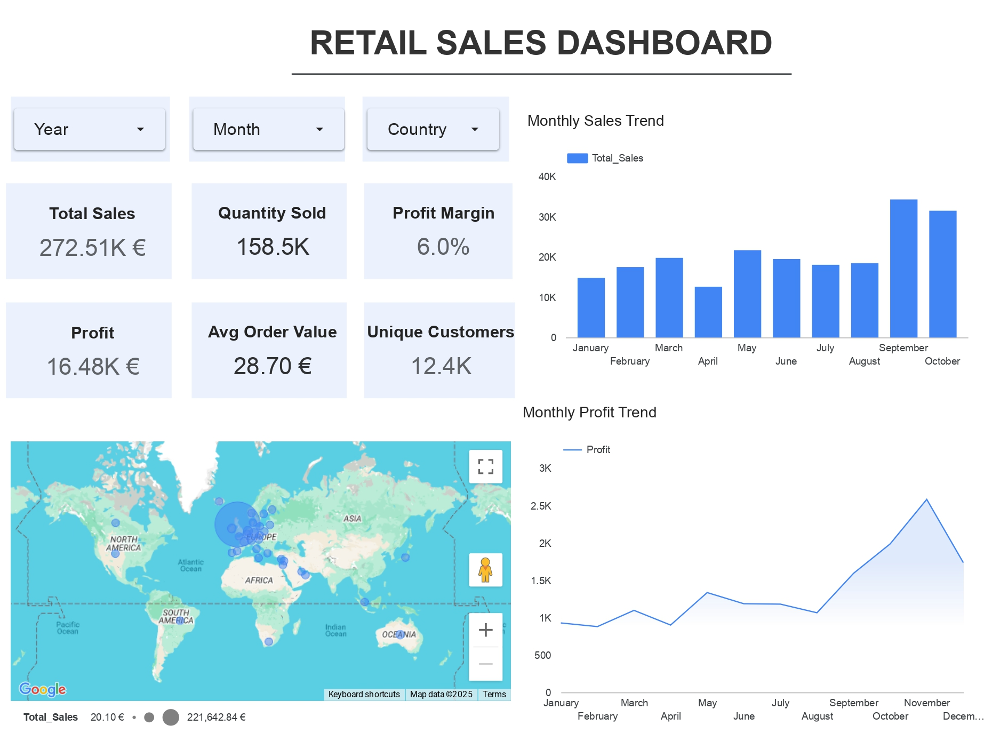

# 🛍️ Retail Sales Dashboard (Exploring Looker Studio)

## 📌 Project Overview
This project is a practice dashboard built using the `retail_sales_data.xlsx` dataset to analyze retail performance.  
It highlights key **sales, profit, and customer metrics** to support data-driven decision making.

---

## 📊 Dashboard Features
- KPI cards for Sales, Profit, Profit Margin, Quantity Sold, Unique Customers, and Average Order Value.  
- **Monthly Sales Trend (Line Chart):** Track revenue across months.  
- **Monthly Profit Trend (Line Chart):** Monitor profitability over time.  
- **Geographic Map:** Visualize sales distribution by country.  
- **Interactive Filters:** Analyze performance across time periods and regions.  

---

## 📂 Repository Contents
- `retail_sales_data.xlsx` → Dataset used for building the dashboard.  
- `retail_sales_dashboard.pdf` → Export of the practice dashboard.  
- `README.md` → Project documentation.  

---

## 🛠️ Tools & Techniques
- **Tool:**  Looker Studio.  
- **Data Preparation:** Basic cleaning and calculated fields (Sales, AOV, Profit Margin).  
- **Metrics:** Created calculated KPIs to measure sales performance, efficiency, and customer behavior.  

---

## 🚀 Key Insights
- Built a dashboard to evaluate overall sales, profit, and customer activity.  
- Identified **trends in revenue and profitability over time**.  
- Highlighted **customer purchasing behavior** through order value and customer counts.  
- Enabled **geographic analysis** of retail performance across regions.  
---

👨‍💻 *This is a practice project created as part of my learning journey in Business Intelligence and Data Analytics.*  
