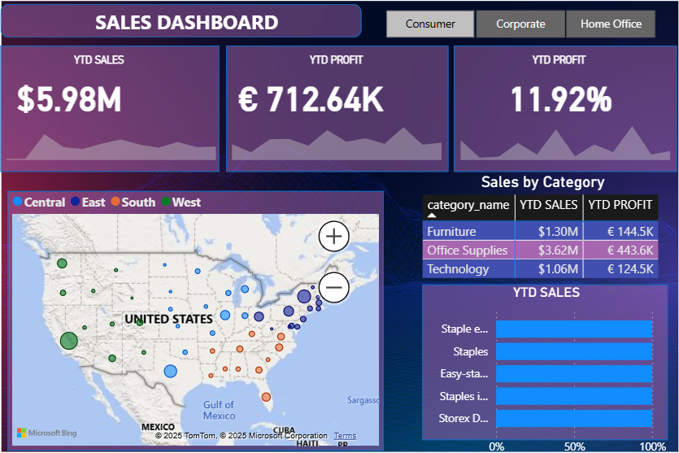

# 🛍️ E-commerce Sales Dashboard

## 📌 Project Overview
This project showcases an **interactive sales dashboard** built to analyze **Year-to-Date (YTD) Sales and Profits** across categories, regions, and customer segments.  
The dashboard provides insights into **business performance** by combining geographical, categorical, and trend-based views.

---

## 📊 Dashboard Features
- **KPIs at a glance**:
  - YTD Sales: **$5.98M**
  - YTD Profit: **€712.64K**
  - Profit Margin: **11.92%**
- **Sales by Category**: Furniture, Office Supplies, Technology
- **Regional Sales Performance**: Central, East, South, West
- **Geographical Map** of sales across the United States
- **Top Products by Sales**

---

## 📂 Repository Contents
- `Dashboard.png` → Final dashboard screenshot  
- `ecommerce_data.csv` → Transaction-level sales and profit dataset  
- `us_state_long_lat_codes.csv` → Latitude & longitude mapping for U.S. states (for geospatial visualization)  

---

## 🛠️ Tools & Technologies
- **Power BI** → Interactive dashboard & visualizations  
- **Excel & Power Query** → Data preprocessing and quick checks  
- **CSV datasets** → Raw sales and geographic data  

---

## 🚀 Key Insights
- Office Supplies accounted for the **highest YTD Sales ($3.62M)**.  
- Furniture delivered **strong profits (€144.5K)** despite lower sales compared to Office Supplies.  
- Sales are concentrated in **Eastern & Central regions** with noticeable differences in profit margins.  

---

## 📈 Learning Outcomes
- Data modeling and integration in Power BI  
- Use of geospatial data for map visualizations  
- Designing **KPI-driven dashboards** for business decision-making  
- Transforming raw CSV data into actionable insights  

---

## 📜 License
This project is for **educational and portfolio purposes**.  
Datasets used here are sample e-commerce data.  

---

👨‍💻 *Created as part of my data analytics portfolio to demonstrate skills in **business intelligence, dashboard design, and sales analytics**.*
